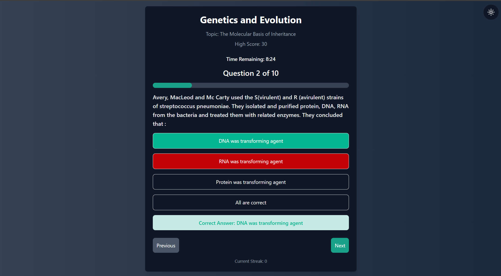
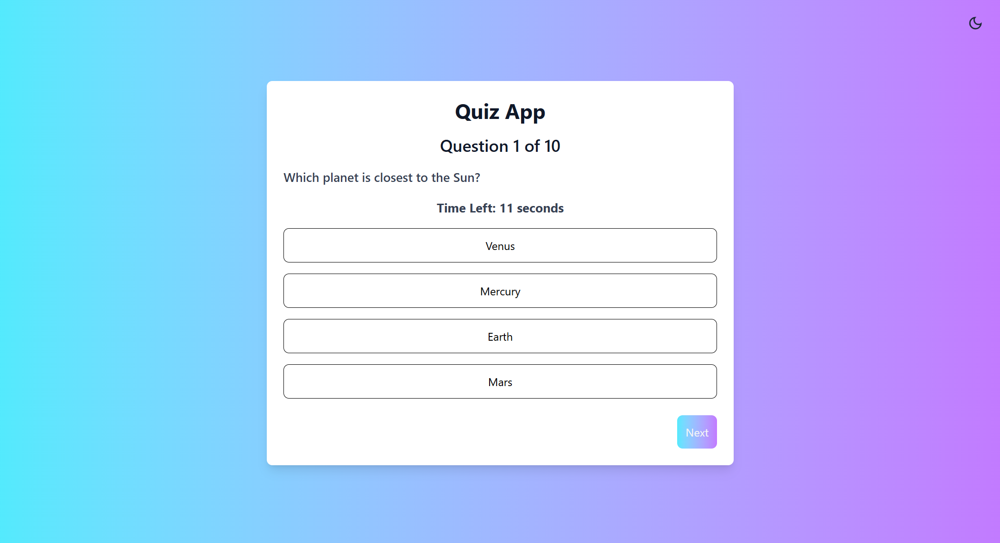
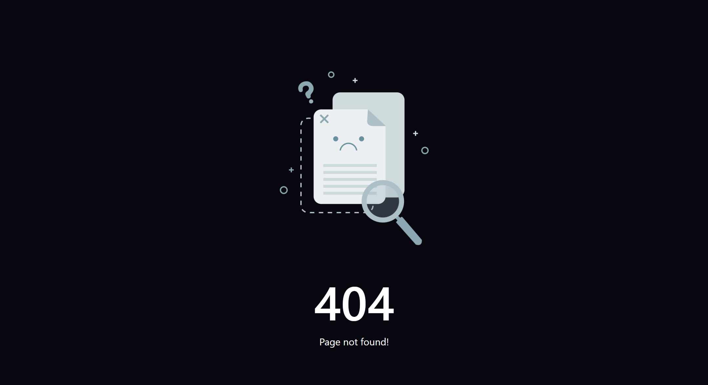

# Quiz App

## Project Overview

The Quiz App is a web application designed to provide an interactive quiz experience. It fetches quiz data from an API and allows users to answer questions, track their scores, and view their progress in real-time. The app includes a timer, scoring system, streak tracking, and a dark mode toggle. It also features a fallback error page for any invalid routes (404 error).

### Key Features:
- **Interactive Quiz**: Users can answer questions from a fetched quiz.
- **Timer**: Countdown timer for each quiz session.
- **Scoring System**: Correct answers increase the score, and incorrect answers decrease it.
- **Streak Tracker**: Displays the longest streak of correct answers.
- **Dark Mode**: Toggle dark and light themes.
- **High Score**: Track high scores across sessions.
- **404 Error Page**: Custom error page for invalid routes.
- **Responsive UI**: The app is designed to be mobile-friendly and adjusts to different screen sizes.

## Table of Contents
- [Project Setup](#project-setup)
- [Usage](#usage)
- [Folder Structure](#folder-structure)
- [Technologies Used](#technologies-used)
- [Screenshots](#screenshots)
- [Video](#video-walkthrough)

## Project Setup

To get started with the app, follow these steps:

### Prerequisites

Ensure you have the following installed:

- [Node.js](https://nodejs.org/) (v14 or higher)
- [npm](https://www.npmjs.com/) (comes bundled with Node.js)

### Installation

1. **Clone the repository**:
   ```bash
   git clone https://github.com/Harshvardhan32/testline-assignment.git

2. **Install dependencies**:
   ```bash
   cd testline-assignment
   npm install
   
3. **Run the app**:
   ```bash
   npm run dev
   
## Usage
1. **Start the quiz**: Upon loading the app, the quiz will automatically begin. Users can answer each question and navigate to the next one.
2. **Timer**: The quiz includes a countdown timer to add a time-based challenge.
3. **Answering Questions**: Users can select answers, and their score and streak will update in real-time.
4. **Theme Toggle**: Switch between light and dark modes by clicking the theme icon in the top-right corner.
5. **Quiz Completion**: Upon finishing all the questions or when the timer runs out, users will see their final score, streak, and high score.
6. **Error Page**: Any invalid route will redirect to a custom 404 error page.

## Folder Structure
The project has the following folder structure:


### Key Notes:
- **Assets in `/src`:** Placing `/assets` inside `/src` ensures they are managed with the app's build tools (e.g., Webpack or Vite).
- **Modular pages:** Grouping reusable pages in `/pages` promotes modularity.
- **Global styles in `index.css`**

## **Technologies Used**

### **Frontend Framework**
- **React.js**: A JavaScript library for building interactive and dynamic user interfaces.

### **Routing**
- **React Router**: Enables seamless navigation and routing between the Quiz page and the Error page.

### **Styling**
- **Tailwind CSS**: A utility-first CSS framework used to style the application with ease and maintain a consistent design.

### **Icons**
- **React Icons**: Provides a wide range of customizable icons, used for the dark mode toggle and enhancing the UI.

## **Screenshots**

Here are some screenshots of the app in action:

### **Quiz Page - Dark Mode**


### **Quiz Page - Light Mode**


### **Error Page (404)**


## **Video**

Here is a short video demonstrating the Quiz App:

[Watch the Video of the Quiz App](https://drive.google.com/file/d/1yBvosluZlX_mwZOUmhh7Gh62kmAgkPjf/view?usp=sharing)